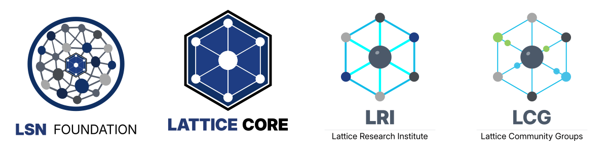

  

# Lattice Semantic Nexus

The Lattice Semantic Nexus is structured around four distinct but related functions:

- **Lattice Core** — Architecture
- **LSN Foundation** — Governance and Stewardship
- **Lattice Research Institute (LRI)** — Independent Research and Analysis
- **Lattice Community Groups (LCG)** — Participation and Community Engagement

The separation of these functions is deliberate.

**Architecture defines. Governance protects. Research analyses. Participation contributes.**

The Nexus is not a separate institution. It is the structured relationship between these four components and the actors that engage with them.

---

## Ecosystem Components

### Lattice Core

The foundational substrate architecture of the ecosystem.

Lattice Core defines the architectural layers, structural relationships, and canonical conditions upon which downstream systems are designed to depend.

### LSN Foundation

The governance authority responsible for stewardship of canonical definitions, governance processes, and protection of the long-term structural integrity of Lattice Core.

### Lattice Research Institute

The independent research and analysis body of the ecosystem.

LRI studies Lattice Core, systems that depend upon it, and the broader landscape of AI-native infrastructure. Research findings do not themselves modify canonical architecture or governance.

### Lattice Community Groups

The participation component of the ecosystem.

LCG provides pathways for practitioners, stakeholders, and community members to contribute knowledge and perspective without acquiring architectural or governance authority.

---

## Repository Structure

Repositories within this organisation may belong to one of the four ecosystem components.

Each repository identifies its institutional owner, authority domain, and repository status within its documentation.

Authority remains with the appropriate ecosystem component and is not conferred by repository location alone.

---

## Governance

This GitHub organisation serves as the shared public repository surface of the Lattice Semantic Nexus.

Administrative stewardship of the organisation is provided by the **LSN Foundation**.

---

## Learn More

- Ecosystem Overview: https://lsn.foundation/ecosystem/
- LSN Foundation: https://lsn.foundation
- Lattice Core: https://latticecore.net
- Lattice Research Institute: https://lattice.institute
- Lattice Community Groups: https://latticegroups.org

---

**Lattice Semantic Nexus**  
Architecture • Governance • Research • Participation
